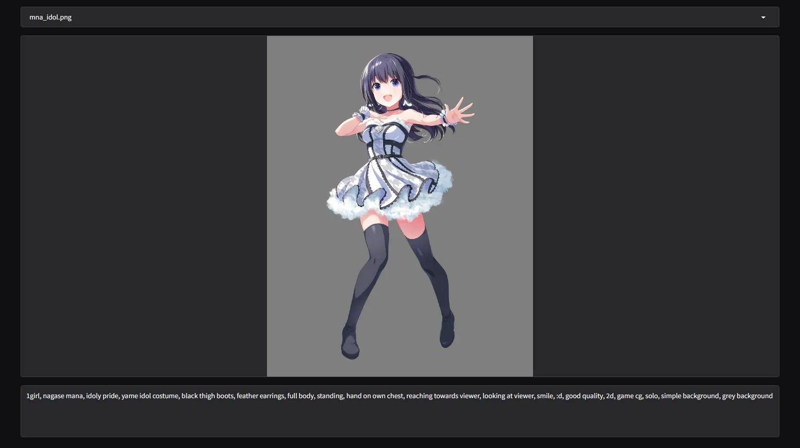

<h1 align="center">CaptionUI</h1>

<p align="center">

</p>

## Getting Started

```bash
git clone https://github.com/Haoming02/CaptionUI
cd CaptionUI
uv run main.py
```

## Control
- **Tab:** Next Image
- **Shift + Tab:** Previous Image
- **Ctrl + S:** Save
